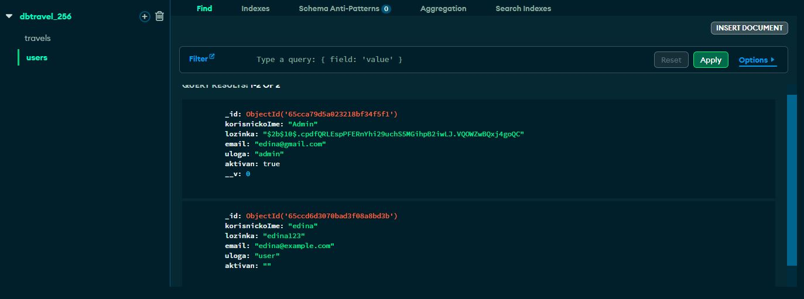
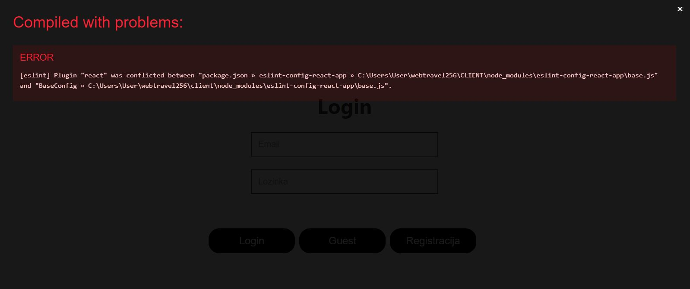
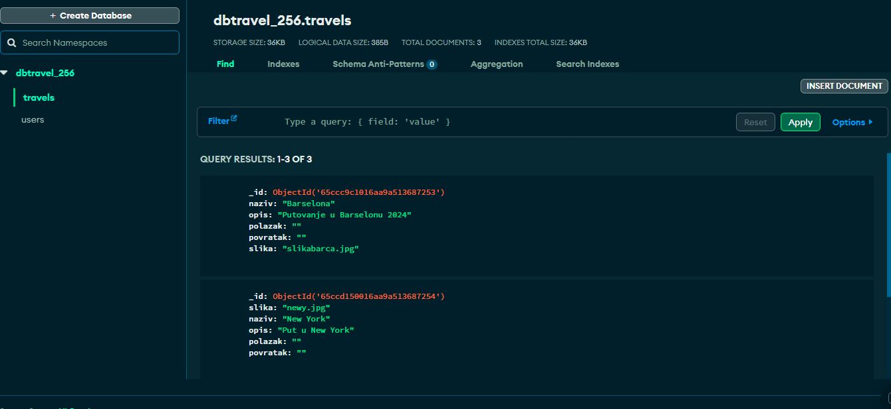
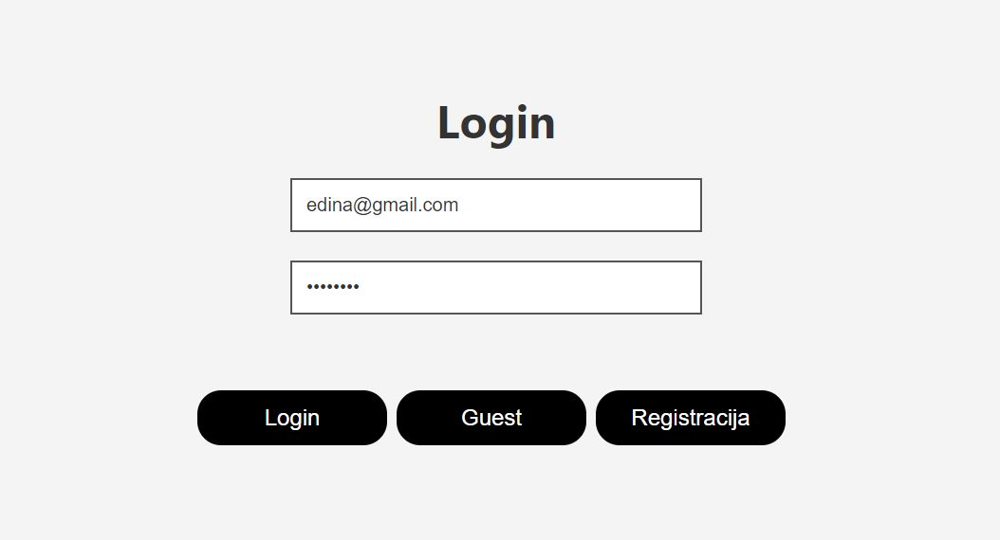
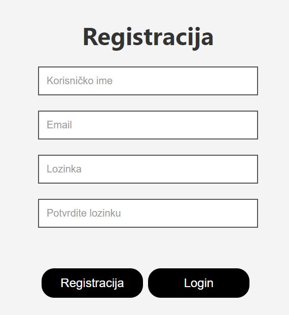
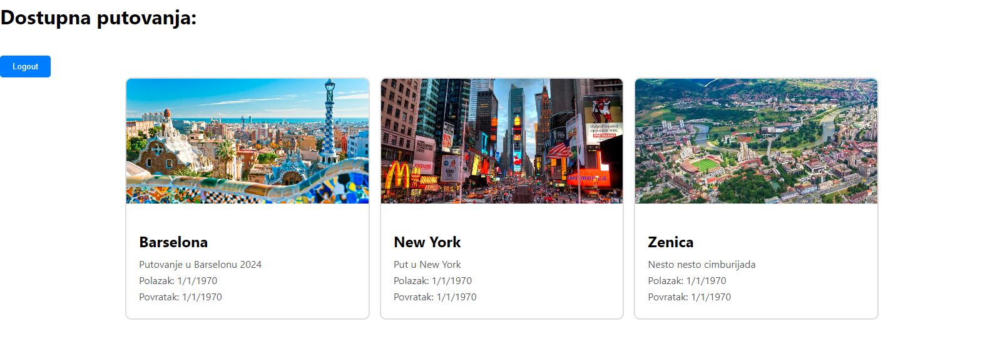

--------------------------------------------------
Pokretanje projekta kroz terminal:
cd server
npm install
node index.js

novi terminal:
cd client
npm install
npm install react (nije htjelo ukoliko ne odvojim)
npm start

localhost:3000
----------------------------------------------------
Projekat je spojen na bazu podataka i 100% radi jer admin je kreiran iz server\index.js i pojavio se u mongodb. Međutim, pri logiranju izbacuje grešku pogrešnog emaila ili lozinke. Ne znam kako ispraviti.

Bilo je problema sa uppercase i lowercase sa React function components. Nakon što je to ispravljeno i pokrenut client u terminalu, pojavila se greška da fali react module koji ne fali i nije falio, te je dotad sve ok radio. Nakon instaliranja tog modula opet, dešava se kompajliranje s greškom. 

Client se pokrene i frontend se prikaže. Login i dalje izbacuje da je lozinka pogrešna, ne znam što. Ali frontend je urađen i spojeno je na bazu. Na slici ispod možete vidjeti izgled baze dbtravel_256 i njenih collections, gdje sam travels unjela manually u bazu a ne kroz kod: 

Projekat ima jednostavan izgled i implementaciju, dvije stranice za login i register, te home stranicu gdje izlistava sva putovanja koja se trenutno nalaze u bazi:

klikom na logout vraca na login, a guest je tu zato što drukcije ne bi mogla vidjeti home stranicu.

